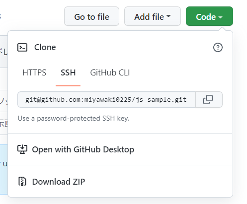

https://qiita.com/suthio/items/2760e4cff0e185fe2db9

大まかな流れ
1. 新規アプリを作成する（rails newやcreate-react-appなど）
2. この時点で.gitファイルまで作成されている
3. GitHubでリモートリポジトリを作成する
4. git initコマンドを実行して初期化する（省略可）
5. git add .コマンドでカレントディレクトリ以下をステージに上げる
6. git commit -m "コミットメッセージ"でローカルリポジトリにコミット
7. GitHub上のリモートリポジトリとローカルリポジトリを紐付ける（git remote add origin リモートURL）& git branch -M main
8. git push -u origin masterコマンドでリモートリポジトリにpushする
9. 完了！

コマンド
- ls（フォルダを一覧表示）
- ls -a(隠しフォルダも一覧表示)
- mkdir(make directory)
- cd(change directory)

フォルダを作成（開発、ssh）
```console
mkdir develop
mkdir .ssh
```

.sshファイルに移動してsshキーを作成
```console
cd .ssh
//キーを作成。オプションはデフォルトにするのでEnter連打
ssh-keygen -C "m-miyawaki@wrapide-act.com"

//クリップボードにコピー
clip < ~/.ssh/id_rsa.pub
```

以下、github上の操作
アカウント>setting>(Access)SSH and GPG keys
`New SSH key` > 先ほどクリップボードにコピーした情報を張り付ける > `Add SSH key`


